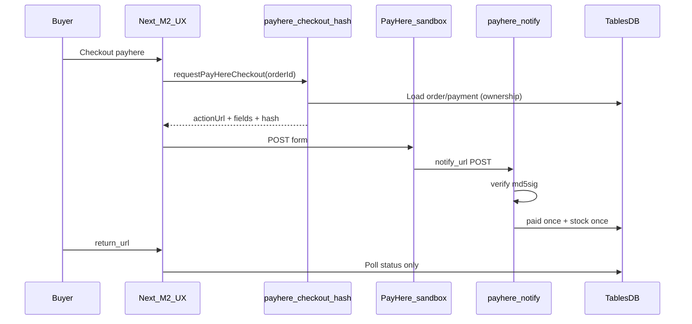
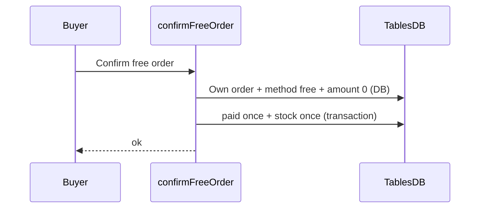

# PayHere contract (Knurdz Marketplace)

> Drafted in **Member 1 step 1.20** (names/payloads/security).  
> Function **bodies**, merchant secret, free confirm, notify logging, sandbox notes: **Member 1** (steps **1.22–1.28**).  
> **1.25:** `requestPayHereCheckout` calls the live hash Function; **sandbox `actionUrl` only** until merchant authorization. Bank / free do not depend on this Function.  
> Checkout UX / return-cancel polling: **Member 2** (steps 2.7–2.9) — calls Member 1 APIs only.

Shared TypeScript: [`lib/types/payhere.ts`](../../lib/types/payhere.ts) · client helper: [`lib/services/payhere.ts`](../../lib/services/payhere.ts).

---

## Ownership

| Piece | Owner |
|-------|--------|
| Contract freeze (this doc + TS types + `requestPayHereCheckout` stub) | Member 1 (1.20) |
| Wire stub → live hash Function, sandbox-only `actionUrl` | Member 1 (1.25) |
| `payhere-checkout-hash` + `payhere-notify` Functions, merchant secret, idempotent `paid`, free confirm | **Member 1** (1.22–1.28) |
| Checkout UI, POST form to PayHere, return/cancel pages that **poll DB** | Member 2 |
| Bank slip approve/reject (admin UI) | Member 4 (default policy) |

---

## Function IDs

| ID | Role | Caller |
|----|------|--------|
| `payhere-checkout-hash` | Build checkout form fields + MD5 `hash` from **DB** order/payment | Next server via session (`requestPayHereCheckout`) |
| `payhere-notify` | Verify `md5sig`, mark payment/order paid **once**, adjust stock once | **PayHere only** (HTTP `notify_url`) — never from browser |

Constants: `FUNCTION_PAYHERE_CHECKOUT_HASH`, `FUNCTION_PAYHERE_NOTIFY` in `lib/types/payhere.ts` (re-exported from `lib/appwrite/config.ts`).

---

## Checkout URLs

| Mode | Form `action` |
|------|----------------|
| Sandbox (step **1.25**, current) | `https://sandbox.payhere.lk/pay/checkout` |
| Live (not authorized yet) | `https://www.payhere.lk/pay/checkout` |

Until merchant authorization, hash Function env `PAYHERE_SANDBOX=false` / `live` returns **501** (same user message as missing env). The Next parser and checkout form refuse any non-sandbox `actionUrl`. Bank transfer and free checkout do **not** call this Function.

Live URL helper `checkoutActionUrl(false)` remains in Function source for a later authorized-live step — it is not used by `payhere-checkout-hash` today.

---

## Hash Function

### Request

```json
{ "orderId": "<orders.$id>" }
```

Type: `PayHereCheckoutHashRequest`.

### Security rules (this Function — Member 1 step 1.22)

Source: [`functions/payhere-checkout-hash/`](../../functions/payhere-checkout-hash/). Execute permission: **`users`** (session `createExecution` only).

1. Require authenticated user: `x-appwrite-user-id` **and** `x-appwrite-user-jwt` (JWT verified via `Account.get()`). Execution inherits session when called from `createSessionClient`.
2. Load order + payment + items from TablesDB with the **user JWT** (least privilege); reject if `buyerId !==` session user (IDOR → generic not-found).
3. Reject if `payment.method !== "payhere"` or amount ≤ 0. Free orders use `confirmFreeOrder` (1.24).
4. **Amount / currency / items** come from DB snapshots — extra client body fields (including `amount`) are ignored.
5. `merchant_secret` only in Function env; never write secret into response JSON (payload is scanned before return).
6. Set `return_url` / `cancel_url` from Function env `APP_URL`; `notify_url` from Function env `PAYHERE_NOTIFY_URL` (public `payhere-notify` URL from step 1.23).
7. **Sandbox only (1.25):** `evaluateSandboxCheckoutPolicy` refuses live env (`false` / `live` / `0` / `no` / `off`) with HTTP 501. Payload `actionUrl` is always the sandbox checkout URL.

Missing merchant id/secret, `APP_URL`, `PAYHERE_NOTIFY_URL`, or live-locked env → HTTP 501 `{ ok: false, error: "PayHere checkout is not configured yet." }`.

### Response

Either a bare `PayHereCheckoutPayload` or `{ "ok": true, "payload": { ... } }`:

```ts
type PayHereCheckoutPayload = {
  actionUrl: string;
  fields: {
    merchant_id: string;
    return_url: string;
    cancel_url: string;
    notify_url: string;
    order_id: string;
    items: string;
    currency: string;
    amount: string; // "1000.00"
    first_name: string;
    last_name: string;
    email: string;
    phone: string;
    address: string;
    city: string;
    country: string;
    hash: string;
  };
};
```

Errors: `{ "ok": false, "error": "<safe user message>" }` with HTTP 4xx/5xx as appropriate.

### Hash formula (server-only)

```
hash = UPPER(MD5(
  merchant_id +
  order_id +
  amount_formatted +
  currency +
  UPPER(MD5(merchant_secret))
))
```

`amount_formatted` = amount with exactly **2** decimal places (e.g. `1000.00`).

### Next.js client

```ts
import { requestPayHereCheckout } from "@/lib/services/payhere";

const result = await requestPayHereCheckout(orderId);
if (!result.ok) { /* toast result.error */ }
// POST result.payload.fields to result.payload.actionUrl (sandbox only)
```

`requestPayHereCheckout` (step **1.25**) calls the live `payhere-checkout-hash` Function via session `createExecution`. Rate-limited with `RATE_LIMITS.checkout`. `parsePayHereCheckoutPayload` requires `actionUrl === PAYHERE_CHECKOUT_SANDBOX_URL`. Missing Function, 404, or 501 → `{ ok: false, error: "PayHere checkout is not configured yet." }`. Bank / free paths never call this helper.

---

## Notify Function

PayHere POSTs `application/x-www-form-urlencoded` to the Function’s public URL (`notify_url`).

Source: [`functions/payhere-notify/`](../../functions/payhere-notify/) (Member 1 step **1.23**).  
Execute permission: **`any`** (PayHere cannot send a user JWT). Auth is **md5sig + merchant id**, not the Appwrite session. Dynamic API key scopes: **databases.read** and **databases.write** (TablesDB).

Never invoke this Function from the browser. Member 2 return/cancel pages poll DB only.

### Fields (see `PAYHERE_NOTIFY_FIELDS`)

`merchant_id`, `order_id`, `payment_id`, `payhere_amount`, `payhere_currency`, `status_code`, `md5sig`, `method`, `status_message`, `custom_1`, `custom_2` (+ card fields for card methods — do not log full PAN).

### md5sig verification (mandatory before any DB write)

```
md5sig = UPPER(MD5(
  merchant_id +
  order_id +
  payhere_amount +
  payhere_currency +
  status_code +
  UPPER(MD5(merchant_secret))
))
```

If local md5sig ≠ posted `md5sig` → **do not** mark paid; respond `200 OK` without mutating payment (stops PayHere retries; attacker cannot settle without the secret).

Missing Function env or TablesDB settle errors → HTTP 500 so PayHere retries.

### Status mapping

| PayHere `status_code` | Meaning | App action (MVP) |
|----------------------|---------|------------------|
| `2` | Success | Set `payments.status = paid`, advance order out of `pending_payment` / into paid flow; set `payherePaymentId`; decrement stock **once** |
| `0` | Pending | Leave pending / log |
| `-1` | Canceled | May set `failed` / leave pending per Member 4 policy |
| `-2` | Failed | `payments.status = failed` |
| `-3` | Chargeback | `refunded` path (coordinate with Member 4) |

Use shared enums from [`lib/types/status.ts`](../../lib/types/status.ts) — do not invent parallel strings.

### Idempotency

- Prefer `payments.idempotencyKey` = `payhere:<PayHere payment_id>` and `payherePaymentId`.
- Replay of the same successful notify must **not** double-decrement stock or double-apply `paid` (already-`paid` → no-op; unique key races re-read `paid`).
- Posted `payhere_amount` / `payhere_currency` must match the **DB** payment row; mismatch → no mutate.
- Success (`2`) still marks `paid` if stock is short (money already captured); stock decrement is clamped at 0.
- Logs: `order_id`, `status_code`, ignore/reject **reason** only — never `md5sig`, merchant secret, or card/PAN fields.

### Trust boundary

- **`notify_url` + verified md5sig** is the source of truth for card payment success.
- `return_url` / `cancel_url` carry **no** trusted payment proof — Member 2 must poll order/payment from DB only.

---

## Free confirm (not a PayHere Function)

Contract name: **`confirmFreeOrder`** (`lib/services/free-order.ts`, Member 1 step **1.24**).

Types: `ConfirmFreeOrderRequest` / `ConfirmFreeOrderResult` in `lib/types/payhere.ts`.  
Eligibility (pure): `evaluateFreeConfirm` in `lib/services/free-order-rules.ts`.  
Member 2 UX calls `confirmFreeOrderAction` → this API; never writes `paid` from the client.

### Rules

1. Session required (`getLoggedInUser`; suspended accounts are treated as signed-out); `order.buyerId ===` session user. Other buyers get a generic not-found (IDOR).
2. Re-load order + payment + items with the **admin SDK**. `payment.method === "free"` and `payment.amount === 0` and `order.totalAmount === 0`. Every line item `unitPrice` / `lineTotal` must be `0`. Amounts are never taken from the request body.
3. Never call PayHere with a forged zero amount for a paid listing. This path does not import or invoke PayHere.
4. Idempotent: already `paid` → success no-op. Concurrent retries that lose the TablesDB transaction re-read payment and succeed if already `paid`. First successful settle sets `payments.idempotencyKey = free:<orderId>`.
5. Stock decrements **once** in the same transaction as `paid` (`decrementRowColumn` `min: 0`). Insufficient stock **rejects** (free path has not collected money). Repair of a half-written row does **not** decrement again.
6. Writes use `APPWRITE_API_KEY` (server-only). Missing key → `{ ok: false, error: "Free order confirmation is not configured yet." }`. Rate-limited per user+IP (`RATE_LIMITS.checkout`).

---

## Sequences

### PayHere card (sandbox)



### Free path



---

## Environment

| Variable | Where | Notes |
|----------|--------|--------|
| `NEXT_PUBLIC_APPWRITE_*` / `NEXT_PUBLIC_APP_URL` | Next.js | Public only |
| `APPWRITE_API_KEY` | Next.js server | Never PayHere secret |
| `APP_URL` | **Function env** | Public origin for `return_url` / `cancel_url` (same value as `NEXT_PUBLIC_APP_URL`, not a `NEXT_PUBLIC_*` inside the Function) |
| `PAYHERE_NOTIFY_URL` | **Function env** | Public HTTP URL of `payhere-notify` (step 1.23). Required before hash can return a complete payload. |
| `PAYHERE_MERCHANT_ID` | **Appwrite Function env** | May appear in checkout form fields |
| `PAYHERE_MERCHANT_SECRET` | **Appwrite Function env only** | Never `NEXT_PUBLIC_*`, never Next app imports, never git |
| `PAYHERE_SANDBOX` | Function env | unset/`true` → sandbox checkout URL. `false`/`live` → **501** until merchant authorization (do not emit live URL). |

**Deploy `payhere-checkout-hash`:** Console → Functions → create with id `payhere-checkout-hash`, runtime Node, entrypoint `src/main.js`, root `functions/payhere-checkout-hash`, build `npm install`, execute **users**. Set the Function env vars above. Do not enable guest execute. Dynamic API key scopes can stay empty (JWT is used for DB reads).

**Deploy `payhere-notify`:** id `payhere-notify`, entrypoint `src/main.js`, root `functions/payhere-notify`, build `npm install`, execute **any**, timeout ≥ 15s. Same merchant env as hash. Dynamic API key scopes: databases.read + databases.write. Copy the Function’s public HTTP URL into hash Function env `PAYHERE_NOTIFY_URL`.

Placeholders in [`.env.example`](../../.env.example) document Function ownership. Local Next `.env.local` should **not** need the merchant secret for normal app boot.

---

## Security checklist

- [x] No merchant secret in client bundles or `NEXT_PUBLIC_*`
- [x] Hash amount from DB, not client (step 1.22)
- [x] Order ownership checked in hash Function (step 1.22)
- [x] Notify verifies md5sig before mutate (step 1.23)
- [x] Notify idempotent (step 1.23)
- [x] Free confirm idempotent (step 1.24)
- [x] Return/cancel pages poll DB only
- [x] Free path never hits PayHere (step 1.24)
- [x] Sandbox-only `actionUrl` (step 1.25) until merchant authorization
- [x] Do not log secrets, full card numbers, or raw bank account numbers

---

## Related

- Schema `payments` / orders: [`SCHEMA.md`](./SCHEMA.md)
- Member guide payments split: [`MEMBER_IMPLEMENTATION_GUIDE.md`](./MEMBER_IMPLEMENTATION_GUIDE.md)
- Work checklist: [`../../WORK_DISTRIBUTION.md`](../../WORK_DISTRIBUTION.md)
