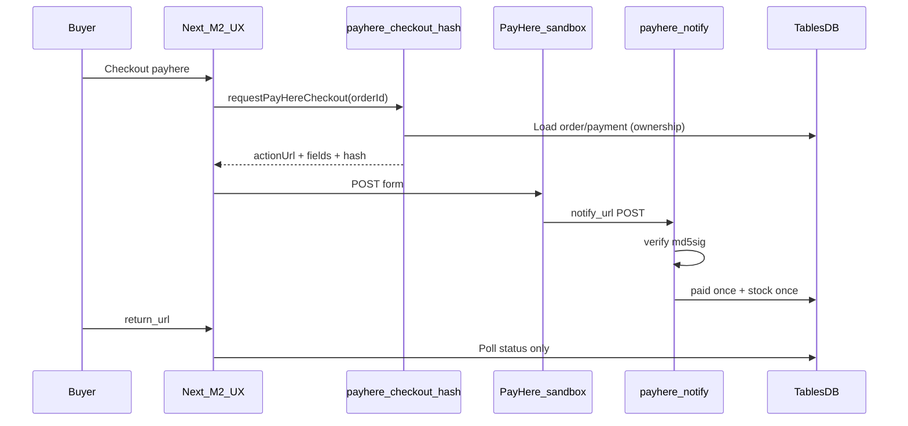
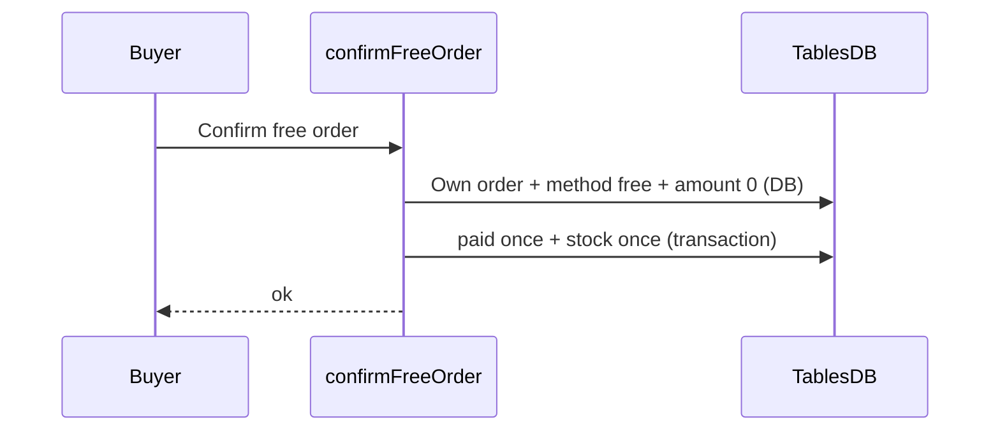

# PayHere contract (Knurdz Marketplace)

> Drafted in **Member 1 step 1.20** (names/payloads/security).  
> Function **bodies**, merchant secret, free confirm, notify logging, sandbox notes: **Member 1** (steps **1.22–1.28**).  
> **1.25:** `requestPayHereCheckout` calls the live hash Function; **sandbox `actionUrl` only** until merchant authorization. Bank / free do not depend on this Function.  
> **1.27:** sandbox test cards + click-path demo (this doc).  
> **1.28:** payment-setup done gate — Members 2 and 4 consume the APIs below.  
> Checkout UX / return-cancel polling: **Member 2** (steps 2.7–2.9) — calls Member 1 APIs only.

Shared TypeScript: [`lib/types/payhere.ts`](../../lib/types/payhere.ts) · client helper: [`lib/services/payhere.ts`](../../lib/services/payhere.ts).

---

## Ownership

| Piece | Owner |
|-------|--------|
| Contract freeze (this doc + TS types + `requestPayHereCheckout` stub) | Member 1 (1.20) |
| Wire stub → live hash Function, sandbox-only `actionUrl` | Member 1 (1.25) |
| `payhere-checkout-hash` + `payhere-notify` Functions, merchant secret, idempotent `paid`, free confirm | **Member 1** (1.22–1.28) |
| Checkout UI, POST form to PayHere, return/cancel pages that **poll DB** | Member 2 |
| Bank slip approve/reject (admin UI) | Member 4 (default policy) |

---

## Function IDs

| ID | Role | Caller |
|----|------|--------|
| `payhere-checkout-hash` | Build checkout form fields + MD5 `hash` from **DB** order/payment | Next server via session (`requestPayHereCheckout`) |
| `payhere-notify` | Verify `md5sig`, mark payment/order paid **once**, adjust stock once | **PayHere only** (HTTP `notify_url`) — never from browser |

Constants: `FUNCTION_PAYHERE_CHECKOUT_HASH`, `FUNCTION_PAYHERE_NOTIFY` in `lib/types/payhere.ts` (re-exported from `lib/appwrite/config.ts`).

---

## Checkout URLs

| Mode | Form `action` |
|------|----------------|
| Sandbox (step **1.25**, current) | `https://sandbox.payhere.lk/pay/checkout` |
| Live (not authorized yet) | `https://www.payhere.lk/pay/checkout` |

Until merchant authorization, hash Function env `PAYHERE_SANDBOX=false` / `live` returns **501** (same user message as missing env). The Next parser and checkout form refuse any non-sandbox `actionUrl`. Bank transfer, cash on delivery, and free checkout do **not** call this Function.

**Platform gate:** `checkout.payhere_enabled` in `platform_settings` must be `"true"` for PayHere to appear at checkout and for `createOrder` / `requestPayHereCheckout` to accept `payhere`. Seed defaults to `"false"` until merchant authorization.

Live URL helper `checkoutActionUrl(false)` remains in Function source for a later authorized-live step — it is not used by `payhere-checkout-hash` today.

---

## Hash Function

### Request

```json
{ "orderId": "<orders.$id>" }
```

Type: `PayHereCheckoutHashRequest`.

### Security rules (this Function — Member 1 step 1.22)

Source: [`functions/payhere-checkout-hash/`](../../functions/payhere-checkout-hash/). Execute permission: **`users`** (session `createExecution` only).

1. Require authenticated user: `x-appwrite-user-id` **and** `x-appwrite-user-jwt` (JWT verified via `Account.get()`). Execution inherits session when called from `createSessionClient`.
2. Load order + payment + items from TablesDB with the **user JWT** (least privilege); reject if `buyerId !==` session user (IDOR → generic not-found).
3. Reject if `payment.method !== "payhere"` or amount ≤ 0. Free orders use `confirmFreeOrder` (1.24).
4. **Amount / currency / items** come from DB snapshots — extra client body fields (including `amount`) are ignored.
5. `merchant_secret` only in Function env; never write secret into response JSON (payload is scanned before return).
6. Set `return_url` / `cancel_url` from Function env `APP_URL`; `notify_url` from Function env `PAYHERE_NOTIFY_URL` (public `payhere-notify` URL from step 1.23).
7. **Sandbox only (1.25):** `evaluateSandboxCheckoutPolicy` refuses live env (`false` / `live` / `0` / `no` / `off`) with HTTP 501. Payload `actionUrl` is always the sandbox checkout URL.

Missing merchant id/secret, `APP_URL`, `PAYHERE_NOTIFY_URL`, or live-locked env → HTTP 501 `{ ok: false, error: "PayHere checkout is not configured yet." }`.

### Response

Either a bare `PayHereCheckoutPayload` or `{ "ok": true, "payload": { ... } }`:

```ts
type PayHereCheckoutPayload = {
  actionUrl: string;
  fields: {
    merchant_id: string;
    return_url: string;
    cancel_url: string;
    notify_url: string;
    order_id: string;
    items: string;
    currency: string;
    amount: string; // "1000.00"
    first_name: string;
    last_name: string;
    email: string;
    phone: string;
    address: string;
    city: string;
    country: string;
    hash: string;
  };
};
```

Errors: `{ "ok": false, "error": "<safe user message>" }` with HTTP 4xx/5xx as appropriate.

### Hash formula (server-only)

```
hash = UPPER(MD5(
  merchant_id +
  order_id +
  amount_formatted +
  currency +
  UPPER(MD5(merchant_secret))
))
```

`amount_formatted` = amount with exactly **2** decimal places (e.g. `1000.00`).

### Next.js client

```ts
import { requestPayHereCheckout } from "@/lib/services/payhere";

const result = await requestPayHereCheckout(orderId);
if (!result.ok) { /* toast result.error */ }
// POST result.payload.fields to result.payload.actionUrl (sandbox only)
```

`requestPayHereCheckout` (step **1.25**) calls the live `payhere-checkout-hash` Function via session `createExecution`. Rate-limited with `RATE_LIMITS.checkout`. `parsePayHereCheckoutPayload` requires `actionUrl === PAYHERE_CHECKOUT_SANDBOX_URL`. Missing Function, 404, or 501 → `{ ok: false, error: "PayHere checkout is not configured yet." }`. Bank / free paths never call this helper.

---

## Notify Function

PayHere POSTs `application/x-www-form-urlencoded` to the Function’s public URL (`notify_url`).

Source: [`functions/payhere-notify/`](../../functions/payhere-notify/) (Member 1 step **1.23**).  
Execute permission: **`any`** (PayHere cannot send a user JWT). Auth is **md5sig + merchant id**, not the Appwrite session. Dynamic API key scopes: **databases.read** and **databases.write** (TablesDB).

Never invoke this Function from the browser. Member 2 return/cancel pages poll DB only.

### Fields (see `PAYHERE_NOTIFY_FIELDS`)

`merchant_id`, `order_id`, `payment_id`, `payhere_amount`, `payhere_currency`, `status_code`, `md5sig`, `method`, `status_message`, `custom_1`, `custom_2` (+ card fields for card methods — do not log full PAN).

### md5sig verification (mandatory before any DB write)

```
md5sig = UPPER(MD5(
  merchant_id +
  order_id +
  payhere_amount +
  payhere_currency +
  status_code +
  UPPER(MD5(merchant_secret))
))
```

If local md5sig ≠ posted `md5sig` → **do not** mark paid; respond `200 OK` without mutating payment (stops PayHere retries; attacker cannot settle without the secret).

Missing Function env or TablesDB settle errors → HTTP 500 so PayHere retries.

### Status mapping

| PayHere `status_code` | Meaning | App action (MVP) |
|----------------------|---------|------------------|
| `2` | Success | Set `payments.status = paid`, advance order out of `pending_payment` / into paid flow; set `payherePaymentId`; decrement stock **once** |
| `0` | Pending | Leave pending / log |
| `-1` | Canceled | May set `failed` / leave pending per Member 4 policy |
| `-2` | Failed | `payments.status = failed` |
| `-3` | Chargeback | `refunded` path (order + payment; already-`refunded` is a no-op) |

Use shared enums from [`lib/types/status.ts`](../../lib/types/status.ts) — do not invent parallel strings.

### Admin refund / cancel (step **6.13**)

Admin overrides on `/admin/orders` write the **platform ledger only** (`cancelAdminOrder` / `refundAdminOrder`). They do **not** call PayHere and never use `PAYHERE_MERCHANT_SECRET` in Next.js.

| Admin action | Order | Payment | Notes |
|--------------|-------|---------|-------|
| Cancel | `pending_payment` / `payment_review` → `cancelled` | not `paid`/`refunded` → `failed` | Unpaid only |
| Refund | `paid` … `completed` → `refunded` | `paid` → `refunded` | Same statuses as notify `-3` |

A later PayHere chargeback notify (`-3`) is idempotent when `payments.status` is already `refunded`. Captured card funds, if they must go back to the buyer, are returned in the **PayHere merchant dashboard** (sandbox), not by this app. **Stock reserved at placement is restored** on platform refund / chargeback.

Bank-slip leftovers after cancel (step **6.14**): a pending `bank_slips` row must not re-settle a `cancelled` order. Approve refuses; reject closes the slip only and never writes `failed` over `paid` / `refunded`. First bank approve sets `payments.idempotencyKey = bank:<orderId>`. Reject-with-retry (buyer still unpaid) returns payment to `pending` and the order to `pending_payment`. Reject-and-cancel is a separate admin action.

### Idempotency

- Prefer `payments.idempotencyKey` = `payhere:<PayHere payment_id>` and `payherePaymentId`.
- Replay of the same successful notify must **not** double-apply `paid` (already-`paid` → no-op; unique key races re-read `paid`). Stock was already reserved at `createOrder`; notify does **not** decrement stock.
- Posted `payhere_amount` / `payhere_currency` must match the **DB** payment row, and `order.totalAmount` must match `payment.amount`; mismatch → no mutate.
- Logs: `order_id`, `status_code`, ignore/reject **reason** only — never `md5sig`, merchant secret, or card/PAN fields.
- **Persist (step 1.26):** each notify attempt writes one row to `payhere_notify_logs` (Function API key). Payload is an allowlist JSON (`merchant_id`, `order_id`, `payment_id`, amounts, `status_code`, `method`, `status_message`, `custom_1`/`custom_2`). A failed log insert **must not** change the HTTP status returned to PayHere (ignore/reject/settle success stay 200). Admin UI: [`listNotifyLogs`](../../lib/services/notify-logs.ts).

### Trust boundary

- **`notify_url` + verified md5sig** is the source of truth for card payment success.
- `return_url` / `cancel_url` carry **no** trusted payment proof — Member 2 must poll order/payment from DB only.

---

## Free confirm (not a PayHere Function)

Contract name: **`confirmFreeOrder`** (`lib/services/free-order.ts`, Member 1 step **1.24**).

Types: `ConfirmFreeOrderRequest` / `ConfirmFreeOrderResult` in `lib/types/payhere.ts`.  
Eligibility (pure): `evaluateFreeConfirm` in `lib/services/free-order-rules.ts`.  
Member 2 UX calls `confirmFreeOrderAction` → this API; never writes `paid` from the client.

### Rules

1. Session required (`getLoggedInUser`; suspended accounts are treated as signed-out); `order.buyerId ===` session user. Other buyers get a generic not-found (IDOR).
2. Re-load order + payment + items with the **admin SDK**. `payment.method === "free"` and `payment.amount === 0` and `order.totalAmount === 0`. Every line item `unitPrice` / `lineTotal` must be `0`. Amounts are never taken from the request body.
3. Never call PayHere with a forged zero amount for a paid listing. This path does not import or invoke PayHere.
4. Idempotent: already `paid` → success no-op. Concurrent retries that lose the TablesDB transaction re-read payment and succeed if already `paid`. First successful settle sets `payments.idempotencyKey = free:<orderId>`.
5. Stock was reserved at `createOrder`. Confirm does **not** decrement again. Confirm still re-checks that each product is still free (`price === 0`) and `available`. Repair of a half-written row does **not** touch stock.
6. Writes use `APPWRITE_API_KEY` (server-only). Missing key → `{ ok: false, error: "Free order confirmation is not configured yet." }`. Rate-limited per user+IP (`RATE_LIMITS.checkout`).

---

## Sequences

### PayHere card (sandbox)



### Free path



---

## Environment

| Variable | Where | Notes |
|----------|--------|--------|
| `NEXT_PUBLIC_APPWRITE_*` / `NEXT_PUBLIC_APP_URL` | Next.js | Public only |
| `APPWRITE_API_KEY` | Next.js server | Never PayHere secret |
| `APP_URL` | **Function env** | Public origin for `return_url` / `cancel_url` (same value as `NEXT_PUBLIC_APP_URL`, not a `NEXT_PUBLIC_*` inside the Function) |
| `PAYHERE_NOTIFY_URL` | **Function env** | Public HTTP URL of `payhere-notify` (step 1.23). Required before hash can return a complete payload. |
| `PAYHERE_MERCHANT_ID` | **Appwrite Function env** | May appear in checkout form fields |
| `PAYHERE_MERCHANT_SECRET` | **Appwrite Function env only** | Never `NEXT_PUBLIC_*`, never Next app imports, never git |
| `PAYHERE_SANDBOX` | Function env | unset/`true` → sandbox checkout URL. `false`/`live` → **501** until merchant authorization (do not emit live URL). |

**Deploy `payhere-checkout-hash`:** Console → Functions → create with id `payhere-checkout-hash`, runtime Node, entrypoint `src/main.js`, root `functions/payhere-checkout-hash`, build `npm install`, execute **users**. Set the Function env vars above. Do not enable guest execute. Dynamic API key scopes can stay empty (JWT is used for DB reads).

**Deploy `payhere-notify`:** id `payhere-notify`, entrypoint `src/main.js`, root `functions/payhere-notify`, build `npm install`, execute **any**, timeout ≥ 15s. Same merchant env as hash. Dynamic API key scopes: databases.read + databases.write. Copy the Function’s public HTTP URL into hash Function env `PAYHERE_NOTIFY_URL`.

Placeholders in [`.env.example`](../../.env.example) document Function ownership. Local Next `.env.local` should **not** need the merchant secret for normal app boot.

---

## Sandbox demo (step 1.27)

Human-runnable PayHere **sandbox** checkout. Official test cards: [PayHere sandbox and testing](https://support.payhere.lk/sandbox-and-testing). No real charges. **Never paste `PAYHERE_MERCHANT_SECRET` into this doc, git, README, or `NEXT_PUBLIC_*`.** Sandbox card numbers below are public PayHere test PANs, not secrets.

### Prerequisites

1. Deploy `payhere-checkout-hash` (execute **users**) and `payhere-notify` (execute **any**) — steps 1.22–1.23.
2. Set Function env (values stay in the Appwrite console, not git):
   - `PAYHERE_MERCHANT_ID` / `PAYHERE_MERCHANT_SECRET`
   - `PAYHERE_SANDBOX` unset or `true` (`false` / `live` → HTTP 501)
   - `APP_URL` — same origin the tester opens (e.g. `http://localhost:3000`)
   - `PAYHERE_NOTIFY_URL` — **public** HTTP URL of `payhere-notify` (not localhost)
3. Next.js: fill `.env.local` from [`.env.example`](../../.env.example), `npm run seed`, `npm run dev`.
4. Checkout toast **“PayHere checkout is not configured yet.”** means missing Function env, undeployed hash Function, or live-locked `PAYHERE_SANDBOX` — not a client hash bug.

### Local Next.js vs `notify_url`

PayHere’s generic FAQ says `notify_url` cannot be localhost. This app already avoids that: `notify_url` is the **public Appwrite Function URL** (`PAYHERE_NOTIFY_URL`). `return_url` / `cancel_url` come from Function `APP_URL` and **may** be `http://localhost:3000` because PayHere redirects the **buyer’s browser**. Do **not** set `notify_url` to localhost or add a tunnel unless you changed that contract.

### Test cards (sandbox only)

| Card number         | Type        | Result   |
| ------------------- | ----------- | -------- |
| `4916217501611292`  | Visa        | Success  |
| `5307732125531191`  | Mastercard  | Success  |
| `346781005510225`   | Amex        | Success  |

Name on card, CVV, and expiry: any valid values. Any card number **not** in this table declines in sandbox.

### Happy path (PayHere)

1. Sign in as demo buyer `buyer@knurdz.demo` (password in [`README.md`](../../README.md) Demo seed — sandbox only).
2. Open `/products/seed_demo_product` (seeded “Demo Sticker Pack”, **500 LKR**), add to cart, go to `/checkout`, choose **PayHere**.
3. Continue on `/checkout/payhere?orderId=…`. Member 2 UX calls `requestPayHereCheckout`; the hash Function signs fields from the **DB** order. Form `action` must stay `https://sandbox.payhere.lk/pay/checkout`.
4. Pay with a success test card.
5. Land on `/checkout/payhere/return?orderId=…`. Wait for DB poll: `payments.status = paid`. **Do not** treat PayHere query params (`status_code`, `payment_id`, `md5sig`) as proof.
6. Confirm the order on `/orders/[id]`.
7. Sign in as `admin@knurdz.demo` → `/admin/payments/notify-logs`. Expect a sanitized **settled** row for that `order_id`. The UI never shows merchant secret, `md5sig`, or card/PAN.

### Decline, cancel, idempotency

- **Decline:** use any card number not in the table. Payment must stay non-`paid` (`pending` or `failed`). Notify log may show **payment_failed** / **ignored** (never secrets).
- **Cancel:** PayHere cancel redirects to `/checkout/payhere/cancel?orderId=…`, which also polls DB only.
- **Already paid:** `/checkout/payhere` shows confirmed and does not re-POST. A replayed success notify must **not** double-decrement stock (step 1.23).

### Free path (seeded)

`/checkout/free` + `confirmFreeOrder` (step 1.24) never call PayHere.

1. Sign in as `buyer@knurdz.demo`.
2. Open `/products/seed_demo_free_product` (seeded “Demo Free Sticker”, **price 0**), add to cart (empty the paid sticker first — carts are single-seller; mixing free + paid totals is not free checkout).
3. `/checkout` → method **Free** (only offered when the cart total is 0).
4. Continue on `/checkout/free?orderId=…` and confirm. Server reloads DB amounts; `payments.status = paid` once.
5. Confirm on `/orders/[id]`.

Bank transfer slip verify is **Member 4**, not this step.

---

## Consumer contract (step 1.28)

Payment setup (1.22–1.28) is **code-complete**. Members 2 and 4 consume these APIs only — do not add a second hash, notify, or `paid` writer.

| Who | Call / read | Must not |
|-----|-------------|----------|
| Member 2 | `requestPayHereCheckout(orderId)` then POST sandbox form; poll DB on return/cancel | Hash locally; put merchant secret in the client; trust `return_url` query params |
| Member 2 | `confirmFreeOrder` / `confirmFreeOrderAction` for `method=free` | Send a forged amount; call PayHere for zero-total orders |
| Member 4 | `/admin/payments/notify-logs` (sanitized) | Implement PayHere Functions; display secrets / PAN |
| Member 4 | Bank slip approve/reject UI (existing) | Treat bank verify as a PayHere path |

**Console (human, once):** both Functions exist (`payhere-checkout-hash` execute **users**, `payhere-notify` execute **any**). Hash env already has `PAYHERE_SANDBOX=true` and `APP_URL=http://localhost:3000`. Copy the **payhere-notify Domains** URL into hash env `PAYHERE_NOTIFY_URL`. Set `PAYHERE_MERCHANT_ID` and `PAYHERE_MERCHANT_SECRET` on **both** Functions in the console (never git / `NEXT_PUBLIC_*`). Until merchant vars + notify URL are set, checkout correctly returns “PayHere checkout is not configured yet.” Sandbox card click-path: [Sandbox demo](#sandbox-demo-step-127). This gate does **not** claim a live Visa charge was completed in the agent session.

---

## Security checklist

- [x] No merchant secret in client bundles or `NEXT_PUBLIC_*`
- [x] Hash amount from DB, not client (step 1.22)
- [x] Order ownership checked in hash Function (step 1.22)
- [x] Notify verifies md5sig before mutate (step 1.23)
- [x] Notify idempotent (step 1.23)
- [x] Free confirm idempotent (step 1.24)
- [x] Return/cancel pages poll DB only
- [x] Free path never hits PayHere (step 1.24)
- [x] Sandbox-only `actionUrl` (step 1.25) until merchant authorization
- [x] Persist sanitized notify outcomes in `payhere_notify_logs` (step 1.26)
- [x] Sandbox demo / test-card notes (step 1.27)
- [x] Payment setup done gate announced (step 1.28)
- [x] Do not log secrets, full card numbers, or raw bank account numbers

---

## Related

- Schema `payments` / orders: [`SCHEMA.md`](./SCHEMA.md)
- Member guide payments split: [`MEMBER_IMPLEMENTATION_GUIDE.md`](./MEMBER_IMPLEMENTATION_GUIDE.md)
- Work checklist: [`../../WORK_DISTRIBUTION.md`](../../WORK_DISTRIBUTION.md)
