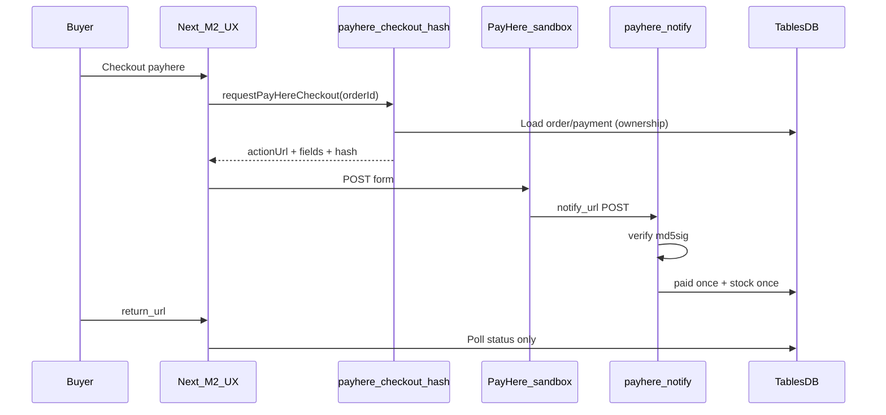
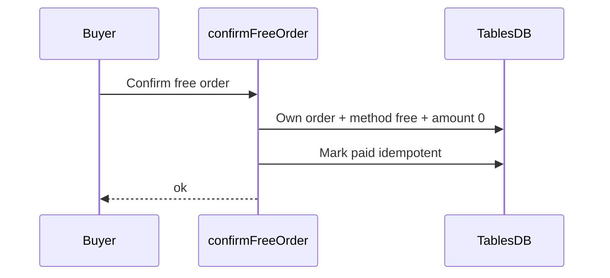

# PayHere contract (Knurdz Marketplace)

> Drafted in **Member 1 step 1.20** (names/payloads/security).  
> Function **bodies**, merchant secret, free confirm, notify logging, sandbox notes: **Member 1** (steps **1.22–1.28**).  
> Checkout UX / return-cancel polling: **Member 2** (steps 2.7–2.9) — calls Member 1 APIs only.

Shared TypeScript: [`lib/types/payhere.ts`](../../lib/types/payhere.ts) · client helper: [`lib/services/payhere.ts`](../../lib/services/payhere.ts).

---

## Ownership

| Piece | Owner |
|-------|--------|
| Contract freeze (this doc + TS types + `requestPayHereCheckout` stub) | Member 1 (1.20) |
| `payhere-checkout-hash` + `payhere-notify` Functions, merchant secret, idempotent `paid`, free confirm | **Member 1** (1.22–1.28) |
| Checkout UI, POST form to PayHere, return/cancel pages that **poll DB** | Member 2 |
| Bank slip approve/reject (admin UI) | Member 4 (default policy) |

---

## Function IDs

| ID | Role | Caller |
|----|------|--------|
| `payhere-checkout-hash` | Build checkout form fields + MD5 `hash` from **DB** order/payment | Next server via session (`requestPayHereCheckout`) |
| `payhere-notify` | Verify `md5sig`, mark payment/order paid **once**, adjust stock once | **PayHere only** (HTTP `notify_url`) — never from browser |

Constants: `FUNCTION_PAYHERE_CHECKOUT_HASH`, `FUNCTION_PAYHERE_NOTIFY` in `lib/types/payhere.ts` (re-exported from `lib/appwrite/config.ts`).

---

## Checkout URLs

| Mode | Form `action` |
|------|----------------|
| Sandbox | `https://sandbox.payhere.lk/pay/checkout` |
| Live | `https://www.payhere.lk/pay/checkout` |

Controlled by Function env `PAYHERE_SANDBOX` (not a client toggle of amount/hash).

---

## Hash Function

### Request

```json
{ "orderId": "<orders.$id>" }
```

Type: `PayHereCheckoutHashRequest`.

### Security rules (Member 4 must enforce)

1. Require authenticated user (execution inherits session when called from `createSessionClient`).
2. Load order + payment from TablesDB; reject if `buyerId !==` session user (IDOR).
3. Reject if `payment.method !== "payhere"` or amount ≤ 0.
4. **Amount / currency / items** come from DB snapshots — never from client body extras.
5. `merchant_secret` only in Function env; never write secret into response JSON.
6. Set `return_url` / `cancel_url` / `notify_url` from trusted app config (e.g. `NEXT_PUBLIC_APP_URL` equivalents in Function env).

### Response

Either a bare `PayHereCheckoutPayload` or `{ "ok": true, "payload": { ... } }`:

```ts
type PayHereCheckoutPayload = {
  actionUrl: string;
  fields: {
    merchant_id: string;
    return_url: string;
    cancel_url: string;
    notify_url: string;
    order_id: string;
    items: string;
    currency: string;
    amount: string; // "1000.00"
    first_name: string;
    last_name: string;
    email: string;
    phone: string;
    address: string;
    city: string;
    country: string;
    hash: string;
  };
};
```

Errors: `{ "ok": false, "error": "<safe user message>" }` with HTTP 4xx/5xx as appropriate.

### Hash formula (server-only)

```
hash = UPPER(MD5(
  merchant_id +
  order_id +
  amount_formatted +
  currency +
  UPPER(MD5(merchant_secret))
))
```

`amount_formatted` = amount with exactly **2** decimal places (e.g. `1000.00`).

### Next.js client

```ts
import { requestPayHereCheckout } from "@/lib/services/payhere";

const result = await requestPayHereCheckout(orderId);
if (!result.ok) { /* toast result.error */ }
// POST result.payload.fields to result.payload.actionUrl
```

Until Member 1 deploys the Function (step 1.22+), the helper returns a typed `{ ok: false, error: "PayHere checkout is not configured yet." }`.

---

## Notify Function

PayHere POSTs `application/x-www-form-urlencoded` to the Function’s public URL (`notify_url`).

### Fields (see `PAYHERE_NOTIFY_FIELDS`)

`merchant_id`, `order_id`, `payment_id`, `payhere_amount`, `payhere_currency`, `status_code`, `md5sig`, `method`, `status_message`, `custom_1`, `custom_2` (+ card fields for card methods — do not log full PAN).

### md5sig verification (mandatory before any DB write)

```
md5sig = UPPER(MD5(
  merchant_id +
  order_id +
  payhere_amount +
  payhere_currency +
  status_code +
  UPPER(MD5(merchant_secret))
))
```

If local md5sig ≠ posted `md5sig` → **do not** mark paid; respond without mutating payment.

### Status mapping

| PayHere `status_code` | Meaning | App action (MVP) |
|----------------------|---------|------------------|
| `2` | Success | Set `payments.status = paid`, advance order out of `pending_payment` / into paid flow; set `payherePaymentId`; decrement stock **once** |
| `0` | Pending | Leave pending / log |
| `-1` | Canceled | May set `failed` / leave pending per Member 4 policy |
| `-2` | Failed | `payments.status = failed` |
| `-3` | Chargeback | `refunded` path (coordinate with Member 4) |

Use shared enums from [`lib/types/status.ts`](../../lib/types/status.ts) — do not invent parallel strings.

### Idempotency

- Prefer `payments.idempotencyKey` / unique `payherePaymentId`.
- Replay of the same successful notify must **not** double-decrement stock or double-apply `paid`.

### Trust boundary

- **`notify_url` + verified md5sig** is the source of truth for card payment success.
- `return_url` / `cancel_url` carry **no** trusted payment proof — Member 2 must poll order/payment from DB only.

---

## Free confirm (not a PayHere Function)

Contract name for Member 2 server action: **`confirmFreeOrder`**.

Types: `ConfirmFreeOrderRequest` / `ConfirmFreeOrderResult` in `lib/types/payhere.ts`.

### Rules

1. Session required; `order.buyerId ===` session user.
2. `payment.method === "free"` and `payment.amount === 0` (and order total 0).
3. Never call PayHere with a forged zero amount for a paid listing.
4. Idempotent: already `paid` → success no-op.
5. Implementation lands with Member 2 order creation (2.6–2.7); this step only freezes the types/docs.

---

## Sequences

### PayHere card (sandbox)



### Free path



---

## Environment

| Variable | Where | Notes |
|----------|--------|--------|
| `NEXT_PUBLIC_APPWRITE_*` / `NEXT_PUBLIC_APP_URL` | Next.js | Public only |
| `APPWRITE_API_KEY` | Next.js server | Never PayHere secret |
| `PAYHERE_MERCHANT_ID` | **Appwrite Function env** | May appear in checkout form fields |
| `PAYHERE_MERCHANT_SECRET` | **Appwrite Function env only** | Never `NEXT_PUBLIC_*`, never Next app imports, never git |
| `PAYHERE_SANDBOX` | Function env | `true` → sandbox checkout URL |

Placeholders in [`.env.example`](../../.env.example) document Function ownership. Local Next `.env.local` should **not** need the merchant secret for normal app boot.

---

## Security checklist

- [ ] No merchant secret in client bundles or `NEXT_PUBLIC_*`
- [ ] Hash amount from DB, not client
- [ ] Order ownership checked in hash Function
- [ ] Notify verifies md5sig before mutate
- [ ] Notify + free confirm idempotent
- [ ] Return/cancel pages poll DB only
- [ ] Free path never hits PayHere
- [ ] Do not log secrets, full card numbers, or raw bank account numbers

---

## Related

- Schema `payments` / orders: [`SCHEMA.md`](./SCHEMA.md)
- Member guide payments split: [`MEMBER_IMPLEMENTATION_GUIDE.md`](./MEMBER_IMPLEMENTATION_GUIDE.md)
- Work checklist: [`../../WORK_DISTRIBUTION.md`](../../WORK_DISTRIBUTION.md)
